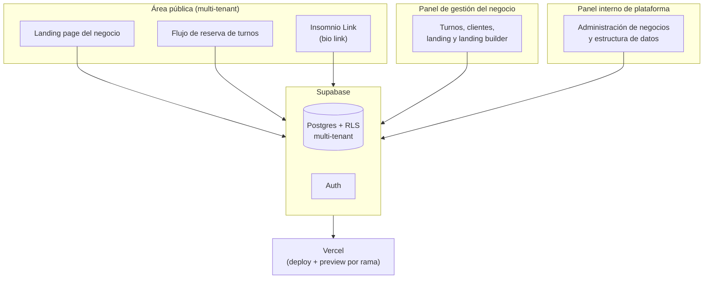

# Insomnio

> Una plataforma de turnos, reservas, landing pages y comunicación para profesionales y negocios que viven de la recurrencia de sus clientes.

Este repositorio es una **vidriera de portfolio**: documenta la idea, el proceso y la arquitectura del proyecto. El código fuente y la base de datos viven en un repositorio privado — acá no vas a encontrar lógica de negocio, credenciales ni esquemas de datos, solo la historia y el diseño del sistema.

---

## El origen: de un experimento de fin de semana a un producto

Insomnio nació como una prueba: ver qué tan lejos se podía llevar la construcción de un producto real trabajando codo a codo con un agente de IA (Claude Code), sin escribir el código a mano. El nombre es literal — el proyecto arrancó un viernes de madrugada y se extendió durante un fin de semana entero de conversación continua con el agente para ver qué se podía construir.

Pero también fue un experimento de **método**: probar si una metodología de gestión de producto podía sostener y ordenar un desarrollo hecho así, desde cero, a esa velocidad. El proceso que se siguió fue siempre el mismo, en cada etapa:

```
Detectar un problema
        ↓
Entender por qué existe y qué necesidad hay detrás
        ↓
Formular hipótesis de solución
        ↓
Construir → Probar → Observar → Corregir
        ↓
MVP
```

La necesidad detectada fue concreta: muchos negocios y profesionales que dependen de la recurrencia de sus clientes (turnos, sesiones, citas) manejan esa recurrencia de forma desordenada, repartida entre WhatsApp, agendas de papel o herramientas que solo resuelven "sacar un turno" y nada más. La oportunidad estaba en unir en un solo sistema: **turnos, reservas, landing page y atención al cliente**.

## Cómo se construyó

Todo el desarrollo se trazó de forma vertical con **Claude Code** como compañero de desarrollo: arquitectura, código e iteraciones sucesivas hasta llegar a la primera versión funcional (MVP v1). El stack técnico:

- **Next.js** (App Router) + **React** + **TypeScript**
- **Supabase** (Postgres + Auth + RLS) como base de datos y backend
- **Vercel** para deployment y preview environments
- **Claude Code** como agente de desarrollo, con GitHub como versionado

## Propuesta de negocio

Insomnio no es solo un gestor de turnos. Está pensado para profesionales y negocios cuya propuesta de valor depende de que sus clientes **vuelvan** — y que hoy tienen ese proceso desorganizado o quieren profesionalizarlo.

La diferencia frente a los gestores de turnos tradicionales es que Insomnio también funciona como **base comunicacional de la marca**: de ahí surgieron dos módulos que van más allá de la agenda —

- **Landing Builder**: cada profesional/negocio arma su propia página de presentación, sin depender de un desarrollador.
- **Insomnio Link**: un módulo tipo "link in bio" (similar a Linktree) para centralizar en un solo enlace todos los canales de contacto y reserva.

El producto se ofrece en **tres planes** distintos, pensados para acompañar desde el profesional independiente hasta negocios con más volumen.

## Arquitectura (a alto nivel)



Puntos distintivos del diseño:

- **Multi-tenant real**: cada negocio tiene su propia landing pública y flujo de reserva aislado por Row Level Security en Supabase — un solo código base sirve a todos los negocios.
- **Tres niveles de acceso**: el visitante público, el dueño del negocio y un nivel interno de administración de la plataforma, cada uno con su propio alcance de permisos.
- **Landing Builder propio**: en vez de integrar un builder externo, la edición de landing vive dentro del mismo producto.

## Hacia dónde va

La idea original no nació buscando ser un negocio — nació como una prueba de concepto. Pero a medida que fue tomando forma, apareció una oportunidad real: competir con las plataformas de turnos existentes, que hoy resuelven bien "sacar un turno" pero muy poco de todo lo demás — interfaz, comunicación con el suscriptor, identidad de marca.

La visión a mediano plazo es que la plataforma se transforme en algo más integral: un módulo de **gestión de contenido y marca** donde, desde un solo lugar, el negocio pueda publicar simultáneamente en sus redes (Instagram, Facebook, X, etc.), integrando turnos + comunicación + branding en un mismo sistema.

## Objetivos y cómo se va a medir

Todavía no hay un modelo de negocio ni KPIs formalmente trazados — el proyecto arrancó como una prueba técnica y recién ahora se está evaluando su potencial real como producto. La primera hipótesis a validar es de adopción: liberar temporalmente el plan intermedio (Fly) para que los negocios lo prueben sin fricción, y medir cuántos continúan en un plan pago (Fly o Pro) versus cuántos vuelven al plan gratuito. A partir de esos primeros datos se van a definir hitos y métricas más formales.

---

*Este documento describe la idea y el proceso, no el producto en producción. Si te interesa el enfoque o querés charlar sobre el proyecto, [contacto].*
