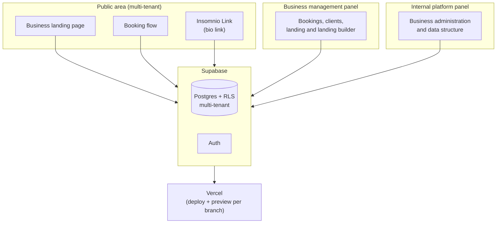

# Insomnio

> A booking, sales, landing-page and communication platform for professionals and businesses that live off client recurrence.

This repository is a **portfolio showcase**: it documents the idea, the process, and the architecture of the project. The source code and database live in a private repository — you won't find business logic, credentials, or data schemas here, only the story and design of the system.

---

## The origin: from a weekend experiment to a product

Insomnio started as an experiment: how far could a real product be taken by working side by side with an AI agent (Claude Code), without writing code by hand. The name is literal — the project began on a Friday at dawn and stretched through an entire weekend of continuous conversation with the agent to see what could be built.

But it was also an experiment in **method**: testing whether a product management methodology could hold and organize a build done this way, from scratch, at that speed. The process followed was always the same, at every stage:

```
Spot a problem
        ↓
Understand why it exists and what need lies behind it
        ↓
Formulate a solution hypothesis
        ↓
Build → Test → Observe → Fix
        ↓
MVP
```

The need identified was concrete: many businesses and professionals whose value depends on client recurrence (appointments, sessions, bookings) handle that recurrence in a disorganized way, spread across WhatsApp, paper agendas, or tools that only solve "book a slot" and nothing else. The opportunity was to bring together, in a single system: **bookings, sales, a landing page, and client communication**.

## How it was built

The entire development was traced vertically with **Claude Code** as a development partner: architecture, code, and successive iterations up to the first working version (MVP v1). The technical stack:

- **Next.js** (App Router) + **React** + **TypeScript**
- **Supabase** (Postgres + Auth + RLS) as database and backend
- **Vercel** for deployment and preview environments
- **Claude Code** as the development agent, with GitHub for version control

## Business proposal

Insomnio isn't just a booking manager. It's built for professionals and businesses whose value proposition depends on their clients **coming back** — and who today have that process disorganized, or want to professionalize it.

The difference from traditional booking tools is that Insomnio also works as the **communication base of the brand**: that's where two modules beyond the agenda came from —

- **Landing Builder**: each professional/business builds their own presentation page, without depending on a developer.
- **Insomnio Link**: a "link in bio" style module (similar to Linktree) to centralize every contact and booking channel in a single link.

The product is offered across **three different plans**, designed to serve everyone from independent professionals to higher-volume businesses.

## Architecture (high level)



Distinctive design points:

- **Real multi-tenancy**: each business has its own public landing page and booking flow, isolated via Row Level Security in Supabase — a single codebase serves every business.
- **Three access levels**: the public visitor, the business owner, and an internal platform administration level, each with its own permission scope.
- **Built-in Landing Builder**: instead of integrating a third-party builder, landing page editing lives inside the product itself.

## Where it's headed

The original idea wasn't born to become a business — it started as a proof of concept. But as it took shape, a real opportunity appeared: competing with existing booking platforms, which today handle "book a slot" well but very little else — interface, communication with subscribers, brand identity.

The mid-term vision is for the platform to become something more integral: a **content and brand management module** where, from a single place, a business can publish simultaneously across its social channels (Instagram, Facebook, X, etc.), integrating bookings + communication + branding into one system.

## Goals and how success will be measured

There's no formal business model or KPIs yet — the project started as a technical experiment, and its real potential as a product is only now being evaluated. The first hypothesis to validate is adoption: temporarily unlocking the mid-tier plan (Fly) so businesses can try it with no friction, and measuring how many continue on a paid plan (Fly or Pro) versus how many go back to the free tier. Once that first data comes in, more formal milestones and metrics will be defined.

---

*This document describes the idea and the process, not the product in production. If the approach interests you or you'd like to talk about the project, reach out at **godoyjonathan51@gmail.com**.*
